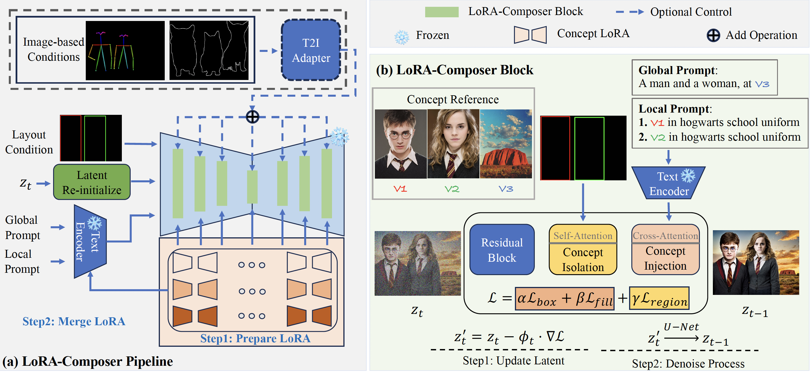
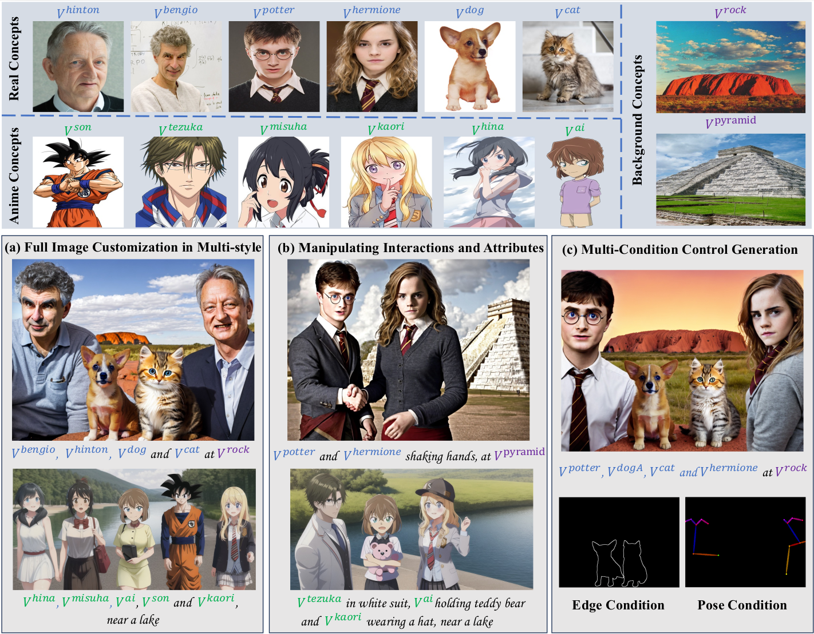
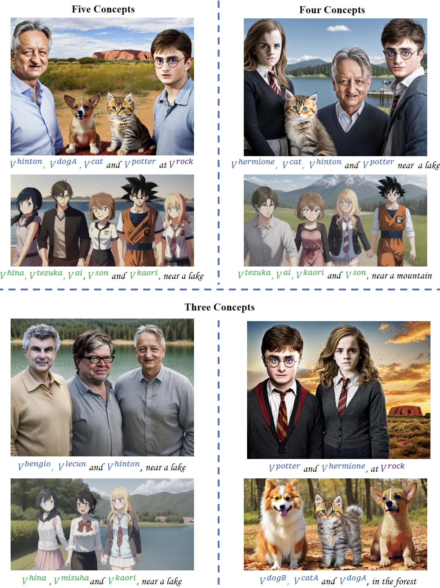

# LoRA-Composer

**[LoRA-Composer: Leveraging Low-Rank Adaptation for Multi-Concept Customization in Training-Free Diffusion Models](https://arxiv.org/abs/2305.18292)**
<br/>
[Yang Yang](https://young98cn.github.io/), [Wen Wang](https://github.com/encounter1997), Liang Peng, Chaotian Song, Yao Chen, Hengjia Li, Xiaolong Yang, Qinglin Lu, Deng Cai, Wei Liu, Boxi Wu
<br/>

[](https://young98cn.github.io/lora_composer_page/)[](https://arxiv.org/abs/2403.11627)




## Highlights


## 📋 Results

### Multi-Concept Sample Results

------

### Multi-Concept Sample Results(with image-based condition)


------

## 🚩 Updates/Todo List

- [ ] Memory optimization  (There is a lot of GPU memory redundancy in the existing code, and N concept LoRAs need to store N pipelines).
- [x] Code Released.


## :wrench: Dependencies and Installation

- Python >= 3.9 (Recommend to use [Anaconda](https://www.anaconda.com/download/#linux) or [Miniconda](https://docs.conda.io/en/latest/miniconda.html))
- Diffusers==0.14.0
- [PyTorch >= 1.12](https://pytorch.org/)
- NVIDIA GPU (60G memory) + [CUDA](https://developer.nvidia.com/cuda-downloads)

### Installation

1. Install torch

```bash
conda create -n loracomposer python=3.10 -y
conda activate loracomposer
# install PyTorch
conda install pytorch==1.12.0 torchvision==0.13.0 torchaudio==0.12.0 cudatoolkit=11.3 -c pytorch -y
```


2. Clone repo & install

```bash
git clone https://github.com/Young98CN/LoRA_Composer.git
cd LoRA_Composer
pip install .

# Install diffusers==0.14.0 with T2I-Adapter support(install from source)
cd diffusers-t2i-adapter
pip install .
```


## ⏬ Pretrained Model and Data Preparation

### Pretrained Model Preparation

We adopt the [ChilloutMix](https://huggingface.co/windwhinny/chilloutmix) for real-world concepts, and [Anything-v4](https://huggingface.co/xyn-ai/anything-v4.0) for anime concepts.

```bash
cd experiments/pretrained_models
# Make sure you have git-lfs installed
git lfs install

# Diffusers-version ChilloutMix
git-lfs clone https://huggingface.co/windwhinny/chilloutmix.git

# Diffusers-version Anything-v4
git-lfs clone https://huggingface.co/andite/anything-v4.0.git --exclude="anything*, Anything*, example*"

mkdir t2i_adapter
cd t2i_adapter

# sketch/openpose adapter of T2I-Adapter
wget https://huggingface.co/TencentARC/T2I-Adapter/resolve/main/models/t2iadapter_sketch_sd14v1.pth
wget https://huggingface.co/TencentARC/T2I-Adapter/resolve/main/models/t2iadapter_openpose_sd14v1.pth
```

### Paper Resources

If you want to quickly reimplement our methods, we provide the following resources used in the paper.

<table>
<tr>
    <th>Paper Resources</th>
    <td style="text-align: center;">Concept Datasets</td>
    <td style="text-align: center;">Single-Concept ED-LoRAs</td>
</tr>
<tr>
    <th>Download Link</td>
    <td style="text-align: center;"><a href="https://drive.google.com/file/d/1YzCldYKouB5M5Nqf9myM-PUiywSedjwe/view?usp=sharing">Google Drive</a></td>
    <td style="text-align: center;"><a href="https://drive.google.com/drive/folders/1PH6Q-KrnW0Bp0IZo3A49PSiya0LXXfP-?usp=sharing">Google Drive</a></td>
</tr>
</table>


After downloading, the path should be arranged as follows:

```
LoRA_Composer
├── mixofshow
├── scripts
├── options
├── experiments
│   ├── composed_edlora  # composed ED-LoRA
│   ├── pretrained_models
│   │   ├── anything-v4.0
│   │   ├── chilloutmix
│   │   ├── t2i_adpator/t2iadapter_*_sd14v1.pth
├── datasets
│   ├── data  # ** Put the dataset in here  **
│   │   ├── characters/
│   │   ├── objects/
│   │   ├── scenes/
│   ├── data_cfgs/lora_composer
│   │   ├── single-concept # train single-concept edlora configs
│   │   ├── region_lora # merge edlora configs
├── loras  # ** Put Single-Concept ED-LoRAs in here  **
│   ├── anime
│   ├── background
│   ├── real
...
```


## :runner: Some instances in the paper
1. Merge the LoRA with the base model
```bash
# in the path of root folder
find scripts/lora_composer_scripts/merge_EDLoRA -type f -name "*.sh" -exec echo "Executing {}" \; -exec bash {} \;

python scripts/lora_composer_scripts/merge_EDLoRA/link_lora2folder.py
```
2. Partial results of the paper can be obtained by running the following command
```bash
bash scripts/lora_composer_scripts/paper_result_scripts/lora_composer_anime.sh
bash scripts/lora_composer_scripts/paper_result_scripts/lora_composer_real.sh
```


## :computer: ED-LoRA Training (For user customized images)
1. Follow by offical implement of [ED-LoRA](https://github.com/TencentARC/Mix-of-Show/tree/research_branch#:~:text=Single%2DClient%20Concept%20Tuning), or follow the [newer release version](https://github.com/TencentARC/Mix-of-Show/tree/main#:~:text=Single%2DClient%20Concept%20Tuning)(**Recommend**). (It is better for performence).
2. Then merge the LoRA with the pre-trained model (For example Haibara_Ai).
```bash
# The newer release version should convert to the LoRA checkpoint fist
python scripts/lora_composer_scripts/convert_old_EDLoRA.py ${ckpt_path} ${save_path}

# Then merge the weight (For older versions, just use this command)
bash scripts/lora_composer_scripts/merge_EDLoRA/anime/merge_ai.sh
```

## 📜 License and Acknowledgement

This project is released under the [Apache 2.0 license](LICENSE).<br>
This codebase builds on [Mix-of-Show](https://github.com/TencentARC/Mix-of-Show/tree/research_branch). Thanks for open-sourcing! Besides, we acknowledge following great open-sourcing projects:
- T2I-Adapter (https://github.com/TencentARC/T2I-Adapter).


## 🌏 Citation

```bibtex
@article{yang2024loracomposer,
        title   = {LoRA-Composer: Leveraging Low-Rank Adaptation for Multi-Concept Customization in Training-Free Diffusion Models},
        author  = {Yang Yang and Wen Wang and Liang Peng and Chaotian Song and Yao Chen and Hengjia Li and Xiaolong Yang and Qinglin Lu and Deng Cai and Boxi Wu and Wei Liu},
        year    = {2024},
        journal = {arXiv preprint arXiv: 2403.11627}
      }
```


## 📧 Contact

If you have any questions and improvement suggestions, please email Yang Yang (yangyang98@zju.edu.cn), or open an issue.
